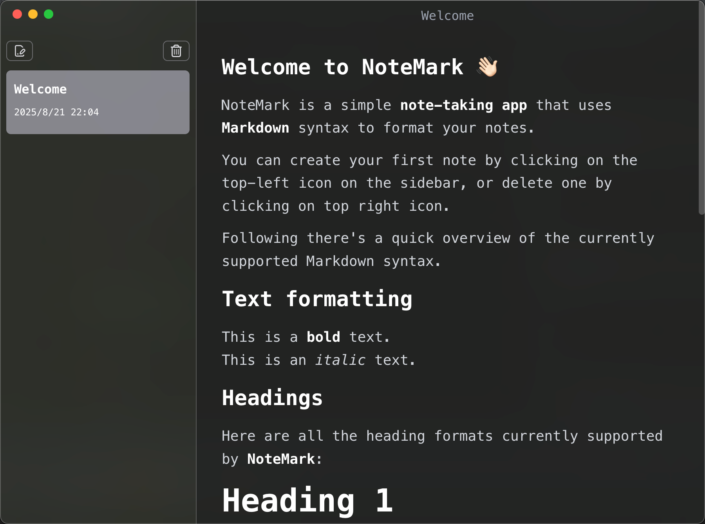

# tk-note

使用Electron、React、TypeScript编写的笔记软件

## 软件界面



## 项目初始化

### 安装

```bash
$ pnpm install
```

### 开发

```bash
$ pnpm dev
```

### 编译

```bash
# For windows
$ pnpm build:win

# For macOS
$ pnpm build:mac

# For Linux
$ pnpm build:linux
```

### 参考视频

- [Build a Markdown Notes app with Electron, React, Typescript, Tailwind and Jotai](https://www.youtube.com/watch?v=t8ane4BDyC8&list=PLwBOMXP2JlCOxQm3z4YGzxozCKbLbC7B5)
- 原作者仓库: [https://www.youtube.com/redirect?event=video_description&redir_token=QUFFLUhqbmhWWlpybzA3R0dKYV8tc2lGd0xseGxiNUwyZ3xBQ3Jtc0tsRWp4UU9qak1yZlRFQ3Bsd09oNmVlQ2dPS01BNFRVbmM0S3dDb2ZONFg5U2V5d0s2UzU2TFNnRTNkaFlIX0U4MXNyN0ZER2tyTExYSlowLURSUXQ3aVNxc0Q5cTA2WUxua0RwLXo5U25tdC1mWDh6WQ&q=https%3A%2F%2Fgithub.com%2FCodeWithGionatha-Labs%2FNoteMark&v=t8ane4BDyC8](https://www.youtube.com/redirect?event=video_description&redir_token=QUFFLUhqbmhWWlpybzA3R0dKYV8tc2lGd0xseGxiNUwyZ3xBQ3Jtc0tsRWp4UU9qak1yZlRFQ3Bsd09oNmVlQ2dPS01BNFRVbmM0S3dDb2ZONFg5U2V5d0s2UzU2TFNnRTNkaFlIX0U4MXNyN0ZER2tyTExYSlowLURSUXQ3aVNxc0Q5cTA2WUxua0RwLXo5U25tdC1mWDh6WQ&q=https%3A%2F%2Fgithub.com%2FCodeWithGionatha-Labs%2FNoteMark&v=t8ane4BDyC8)
